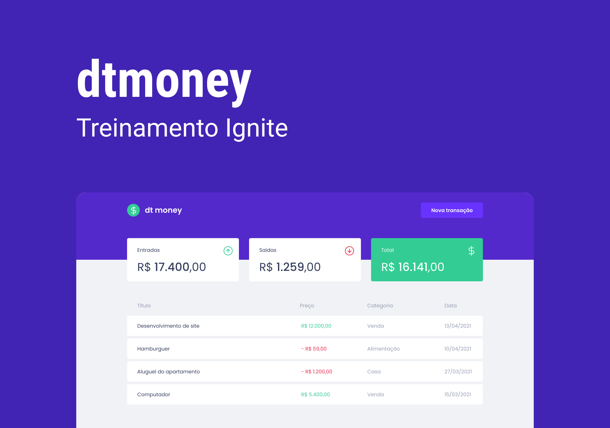

<p align="center">
  
</p>

<h1 align="center">
    
</h1>

<br>

## 🧪 Tecnologias

Esse projeto foi desenvolvido com as seguintes tecnologias:

- [React](https://reactjs.org)
- [TypeScript](https://www.typescriptlang.org/)
- [MirageJS](https://miragejs.com)

## 🚀 Como executar

Clone o projeto e acesse a pasta do mesmo.

```bash
$ git clone https://github.com/samuel-ventura/ignite-dtmoney-trilha-reactjs
$ cd ignite-dtmoney-trilha-reactjs

```

Para iniciá-lo, siga os passos abaixo:
```bash
# Instalar as dependências
$ npm install

# Iniciar o projeto
$ npm start
```
O app estará disponível no seu browser pelo endereço http://localhost:3000.

## 💻 Projeto

O dtmoney é uma ferramenta de controle de finanças pessoais, onde você pode inserir os seus ganhos e gastos mensais para poder se organizar melhor.

Este é um projeto desenvolvido durante as aulas da **[Rocketseat](https://www.rocketseat.com.br)**.

---

Feito com 💜 by Samuel Ventura + Rocketseat 👋🏻 [Participe da comunidade Rocket](https://discord.gg/gKUVrzrPrU)